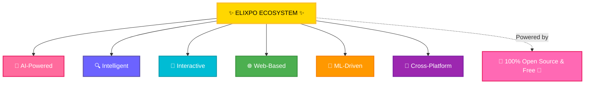
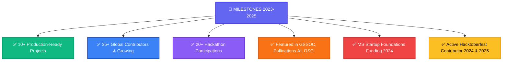
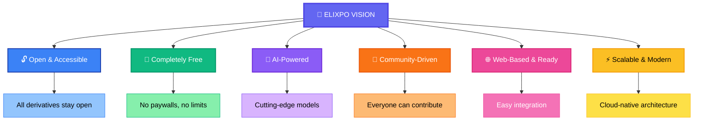

  

<h1 align="center">✨ Elixpo Organization Overview ✨</h1>

  <strong>Enhanced Learning and Intelligence Process Optimization</strong> 
  <em>A Developer-First Open Source Ecosystem</em>

---

## 🌟 Welcome to Elixpo

Elixpo is a collaborative open-source organization born in 2023 as a college initiative and evolved into a thriving ecosystem of **17+ interconnected projects**. We're dedicated to building **open, ethical, and accessible AI tools** that empower developers and creators worldwide.

---

## 🚀 Our Core Platform Projects

| 🎨 Creative | 🔍 Intelligence | 💬 Community | 🛠️ Tools |
|---|---|---|---|
| **Elixpo Art** | **Elixpo Search** | **Elixpo Chat** | **Sketch** |
| AI Art Generation | AI-Powered Search | AI Chatbots | Collaborative Canvas |
| **Verse** | **Emoji Transnet** | **Jackey** | **Inkflow** |

---

## 🏆 Key Achievements

---

## 💡 Technology Stack

---

## 📈 Contribution Stats

  <a href="https://star-history.com/#Circuit-Overtime/elixpo_chapter&Date">
    <picture>
      <source media="(prefers-color-scheme: dark)" srcset="https://api.star-history.com/svg?repos=Circuit-Overtime/elixpo_chapter&type=Date&theme=dark" />
      <source media="(prefers-color-scheme: light)" srcset="https://api.star-history.com/svg?repos=Circuit-Overtime/elixpo_chapter&type=Date" />
      
    </picture>
  </a>

---

## 🎯 Our Mission & Vision

---

## 🤝 How to Get Involved

### We went for Hacktoberfest 2025!

We had on boarded over 20+ contributors during Hacktoberfest 2024 and looking forward to more in 2025. Join us in making open-source AI tools accessible to all!

### 📖 Getting Started

1. **Explore:** Check out our [main repository](https://github.com/Circuit-Overtime/elixpo_chapter)
2. **Read:** Review our [Contributing Guidelines](https://github.com/Circuit-Overtime/elixpo_chapter/blob/main/CONTRIBUTING.md)
3. **Contribute:** Pick an issue and start coding!
4. **Connect:** Join our community and collaborate

---

## 🌐 Live Projects & Demos

| Project | Link | Status |
|---------|------|--------|
| **Elixpo Art** | [elixpo.com](https://elixpo.com) | 🟢 Live |
| **Elixpo Art Chrome Extension** | [Chrome Store](https://chromewebstore.google.com/detail/elixpo-art-select-text-an/hcjdeknbbbllfllddkbacfgehddpnhdh) | 🟢 Live |
| **Elixpo Blogs** | [elixpo.com/blogs](https://elixpo.com/blogs) | 🟢 Live |
| **Jackey Discord Bot** | [jackey.elixpo.com](https://jackey.elixpo.com) | 🟢 Live |
| **Emoji Translator** | [HuggingFace](https://huggingface.co/Elixpo/Emoji-Contextual-Translator) | 🟢 Live |
| **LlamaMedicine** | [Ollama](https://ollama.com/Elixpo/LlamaMedicine) | 🟢 Live |

---

## 💖 Support & Recognition

  

### 🌟 Nominate the founder for GitHub Stars!

If Elixpo has helped you on your open-source journey, consider nominating **@Circuit-Overtime** for the [GitHub Stars Program](https://stars.github.com/nominate/).

---

## 💰 Funding & Partnerships

We're powered by community support and strategic partnerships:

- 🎁 **Pollinations AI** - Compute & Infrastructure
- 🚀 **Microsoft Startup Foundations** - 2024 Funding
- 👥 **35+ Global Contributors** - Our backbone
- 💖 **Community Donations** - Fuel for growth

**Interested in sponsoring?** Visit our [GitHub Sponsors](https://github.com/sponsors/Circuit-Overtime) or reach out to discuss partnerships.

---

---

## 🔗 Quick Links

- 🏠 [Main Repository](https://github.com/Circuit-Overtime/elixpo_chapter)
- 📋 [Code of Conduct](https://github.com/Circuit-Overtime/elixpo_chapter/blob/main/CODE_OF_CONDUCT.md)
- 🤝 [Contributing Guide](https://github.com/Circuit-Overtime/elixpo_chapter/blob/main/CONTRIBUTING.md)
- 👥 [Contributors](https://github.com/Circuit-Overtime/elixpo_chapter/blob/main/CONTRIBUTORS.md)
- 📝 [Security Policy](https://github.com/Circuit-Overtime/elixpo_chapter/blob/main/SECURITY.md)

---

  

  <strong>Made with ❤️ by Circuit-Overtime & the Global Elixpo Community</strong> 
  <em>Building the Future of Open-Source AI, Together.</em>

