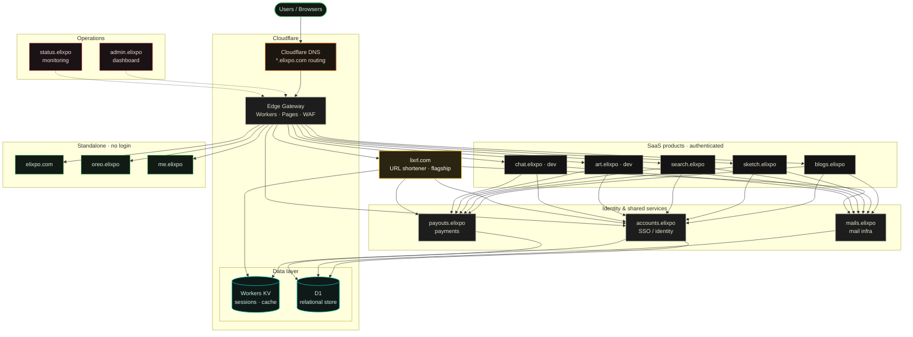

<!--
  ELIXPO README - STANDARD TEMPLATE
  This is the canonical README format for every Elixpo repository.
  Keep the section order. Fill the "Exclusive" section only if this repo ships
  something exclusive (an npm package, a VS Code extension, a hosted service,
  a paid tier). Otherwise state "None" and rely on the base sections.
-->

  

<h1 align="center">Elixpo Chapter</h1>

  <strong>The open-source umbrella for an open, ethical, and accessible ecosystem of AI and developer tools.</strong> 
  Free and open source, built by a global community of contributors since 2023.

  <a href="https://elixpo.com">Website</a> ·
  <a href="https://github.com/orgs/elixpo/discussions">Discussions</a> ·
  <a href="https://github.com/elixpo/elixpo_chapter">Monorepo</a> ·
  <a href="https://github.com/sponsors/Circuit-Overtime">Sponsor</a>

  

### **💖 If you believe in open and accessible projects, please leave a ⭐ on the repository!**

---

## About

**Elixpo Chapter** is the open-source umbrella / monorepo for the whole Elixpo
ecosystem — the org's flagship repository. It began in 2023 as a small college
initiative and has grown into a collaborative, community-driven ecosystem of
interconnected tools for creating, writing, drawing, searching, and building on
the web. In just a couple of years it has grown into a series of 9+ projects,
a global community, and participation in numerous hackathons and open-source
programs.

Our belief is simple: **AI and great software should be open, ethical, and free
for everyone.** Every tool below is open source, free to use, and shaped by
contributors from around the world. No paywalls, no premium tiers, no sign-up
walls on our public tools.

> This repository is the **monorepo / chapter umbrella** for the ecosystem. The
> individual products inside it each live as a sub-project and declare their own
> product-specific terms.

### 🚀 Our mission & vision

At Elixpo, we are dedicated to building a future where AI is **open, ethical, and
accessible to everyone**. Our mission is to create a community-driven ecosystem
where developers, creators, and enthusiasts can collaborate, learn, and innovate
without barriers like paywalls or proprietary restrictions. We believe in
transparency, responsible development, and the power of interconnected tools to
build a better future.

**Key features**

- 🔓 **100% Open Source:** Licensed under the Elixpo standard (MIT for code,
  CC-BY-4.0 for assets) to keep everything free and reusable.
- 💸 **Completely Free:** All our tools and platforms are free to use, forever.
- 🤖 **AI-Powered:** From art generation to search, AI is at the core of what we do.
- 🤝 **Community-Driven:** We thrive on collaboration and welcome contributions from all.
- 🌐 **Web-Based & Embeddable:** Easily accessible through web interfaces and simple to integrate.

### 👑 Key achievements

- **`9+` Open Source Projects** successfully built and deployed.
- **`45+` Global Contributors** have shaped the Elixpo ecosystem.
- **`20+` Hackathons** participated in, fostering innovation and rapid development.
- **Featured in Major Programs** like **GSSOC**, **Pollinations.AI**, and **OSCI**.
- **Recognized by MS Startup Foundations** with funding in 2024.
- **Active Participant** in **Hacktoberfest 2024 & 2025**.

<a href="https://star-history.com/#elixpo/elixpo_chapter&Date">
  <picture>
    <source media="(prefers-color-scheme: dark)" srcset="https://api.star-history.com/svg?repos=elixpo/elixpo_chapter&type=Date&theme=dark" />
    <source media="(prefers-color-scheme: light)" srcset="https://api.star-history.com/svg?repos=elixpo/elixpo_chapter&type=Date" />
    
  </picture>
</a>

## The ecosystem

| Tool | What it does | Link |
| --- | --- | --- |
| 🎨 **Elixpo Art** | AI image generation _(under dev)_ | [art.elixpo.com](https://elixpo.com) |
| ✍️ **Elixpo Blogs** | A rich, modern writing and publishing space | [blogs.elixpo.com](https://blogs.elixpo.com) |
| 🖊️ **LixSketch** | A hand-drawn style whiteboard for ideas and diagrams | [sketch.elixpo.com](https://sketch.elixpo.com) |
| 💬 **Elixpo Chat** | A fluid, real-time AI chat experience _(under dev)_ | [chat.elixpo.com](https://chat.elixpo.com) |
| 🔎 **Elixpo Search** | Fast, AI-assisted search | [search.elixpo.com](https://search.elixpo.com) |
| 👤 **Elixpo Accounts** | One identity (SSO) across the ecosystem | [accounts.elixpo.com](https://accounts.elixpo.com) |
| 🔗 **lixrl** | Our flagship URL shortener | [lixrl.com](https://lixrl.com) |
| 🪪 **Portfolios** | Personal pages to showcase your work | [me.elixpo.com](https://me.elixpo.com) |
| 🐼 **Oreo** | The mascot's home | [oreo.elixpo.com](https://oreo.elixpo.com) |

Developers can drop our editors into their own projects with the
**`@elixpo/lixsketch`** and **`@elixpo/lixeditor`** packages, on npm and as VS
Code extensions.

### Recent releases

- **Elixpo Blogs** — [Official blogging site of Elixpo](https://blogs.elixpo.com): easily write and upload technical blogs.
- **Elixpo Accounts** — [accounts.elixpo.com](https://accounts.elixpo.com): the parent platform that orchestrates accounts across every Elixpo service.
- **lixrl** — [lixrl.com](https://lixrl.com): our flagship URL shortener for Elixpo and other orchestrations, on Cloudflare's edge.
- **Elixpo Sketch** — [sketch.elixpo.com](https://sketch.elixpo.com): a WYSIWYG canvas for collaborative short visual presentations.
- **Elixpo Chat** — [chat.elixpo.com](https://chat.elixpo.com): an open web UI powered by the lixSearch service.
- **Elixpo Search** — [search.elixpo.com](https://search.elixpo.com): a search pipeline built on a 3-tier caching architecture.
- **Elixpo** — [elixpo.com](https://elixpo.com): the official platform for all of our projects in the Elixpo series.
- **Elixpo Portfolio** — [me.elixpo.com](https://me.elixpo.com): a personal portfolio service for Elixpo developers.
- **Tommy** — [Discord-GitHub orchestrator](https://github.com/elixpo/tommy): fully orchestrate GitHub Issues, PRs, and Projects directly from Discord.

### Extended flagship releases (packages & extensions)

- **[`@elixpo/lixsketch`](https://www.npmjs.com/package/@elixpo/lixsketch)** — open-source SVG whiteboard engine with a hand-drawn aesthetic; the core drawing engine behind [LixSketch](https://github.com/elixpo/lixsketch).
- **[`@elixpo/lixeditor`](https://www.npmjs.com/package/@elixpo/lixeditor)** — a rich WYSIWYG block editor and renderer built on BlockNote, with LaTeX, Mermaid diagrams, and syntax-highlighted code; the core editor behind [LixBlogs](https://github.com/elixpo/elixpoblogs).
- **[LixSketch VS Code Extension](https://marketplace.visualstudio.com/items?itemName=elixpo.lixsketch)** — open-source whiteboard diagrams inside VS Code; draw, sketch, and save `.lixsketch` files.
- **[LixEditor VS Code Extension](https://marketplace.visualstudio.com/items?itemName=elixpo.lixeditor)** — a rich block editor for `.lixeditor` files with LaTeX, Mermaid diagrams, and syntax-highlighted code.

## Architecture

Everything runs on **Cloudflare's edge**. A shared platform layer backs the
ecosystem — **accounts.elixpo** (SSO / identity), **mails.elixpo** (mail infra),
and **payouts.elixpo** (payments) — sitting behind the edge gateway and the D1 /
Workers KV data layer. The SaaS products (Blogs, Sketch, Search, Art, Chat) and
the flagship **lixrl.com** all authenticate through Accounts and share the Mail
and Payouts infra, while the login-free surfaces (elixpo.com, oreo.elixpo,
me.elixpo) stay standalone. **admin.elixpo** and **status.elixpo** observe it all.

A rendered, interactive version lives at **[elixpo.com/architecture](https://elixpo.com/architecture)**.

> **Development note:** Elixpo is a parallel development initiative with multiple
> sub-projects evolving simultaneously within this monorepo. Each project follows
> its own dedicated development track and process, covering diverse fields across
> computer science. We actively welcome external open-source projects — if you'd
> like your project featured here, submit a proposal! Accepted projects are listed
> as contributors and included under the Elixpo licensing standard.

## Built by the community

Elixpo is made by people, in the open. **45+ contributors** have shaped these
tools, with a small core team steering the way:

- **Ayushman Bhattacharya** - Founder & Lead ([@Circuit-Overtime](https://github.com/Circuit-Overtime))
- **Vivek Yadav** - Lead Co-Dev ([@ez-vivek](https://github.com/ez-vivek))
- **Anwesha Chakraborty** - Core Maintainer ([@anwe-ch](https://github.com/anwe-ch))

Everyone is welcome. See **[CONTRIBUTING.md](CONTRIBUTING.md)** and our
**[Code of Conduct](CODE_OF_CONDUCT.md)**.

### Funding

This project is funded through a mix of personal investment, community
contributions, and generous infrastructure support. Our cloud compute and VPS
resources are provided by [Pollinations AI](https://pollinations.ai) — special
thanks to [Thomas Haferlach](https://github.com/voodoohop) and the Pollinations
team for enabling our large-scale AI workloads.

We are actively seeking sponsors to help us grow and sustain the project. If you
or your organization would like to support Elixpo, please visit our
[GitHub Sponsors page](https://github.com/sponsors/Circuit-Overtime) or reach
out to discuss partnership opportunities. Your support helps us cover
infrastructure costs, accelerate development, and expand our open-source
initiatives.

## Recognition & programs

Elixpo has taken part in and been supported by **GSSOC**, **Hacktoberfest**,
**Pollinations.AI**, **MS Startup Foundations**, and **OSCI**.

### 🌟 GitHub Stars Program — your support matters!

  

> Your support towards the nomination would mean a lot! If you are happy
> contributing to <strong>[Elixpo Chapter](https://github.com/elixpo)</strong>, or
> you have known me from my tenure as a Google Developer Groups on Campus
> Organiser (2025-2026) and you are genuinely happy, please do leave a nomination.

**How to nominate (takes < 20 seconds):** Visit the
**[GitHub Stars Program](https://stars.github.com/nominate/)** • sign in with your
GitHub account • provide my GitHub username: `Circuit-Overtime` • add a short,
honest note about how I've supported you.

  

## Get involved

- 💬 **Join the conversation** in [GitHub Discussions](https://github.com/orgs/elixpo/discussions).
- 🚀 **Submit your project** to be featured across the ecosystem.
- 🛠️ **Contribute** - browse good first issues in the [monorepo](https://github.com/elixpo/elixpo_chapter).
- ❤️ **Support us** via [GitHub Sponsors](https://github.com/sponsors/Circuit-Overtime).

### 🎉 Hacktoberfest

We enthusiastically welcome contributions from developers around the world.

- **Find issues:** We curate issues perfect for new contributors — look for ones tagged `hacktoberfest accepted` and `hacktoberfest2025` in our [issue tracker](https://github.com/elixpo/elixpo_chapter/issues).
- **Read the guidelines:** Before submitting a PR, please review our [Code of Conduct](./CODE_OF_CONDUCT.md) and [Contributing Guidelines](./CONTRIBUTING.md).

## Brand assets

The Elixpo and Oreo brand — marks, the mascot, palette, and usage rules — is the
brand source of truth. A browsable kit is at
**[elixpo.com/assets](https://elixpo.com/assets)**. Brand assets are provided
under [CC-BY-4.0](LICENSES/preferred/CC-BY-4.0) with the
[Oreo-trademarks exception](LICENSES/exceptions/Oreo-trademarks).

## License

Elixpo uses one **licensing standard** across every repository:

- **Code** - [MIT](LICENSES/preferred/MIT) (with the [Oreo-trademarks exception](LICENSES/exceptions/Oreo-trademarks)).
- **Brand & visual assets** - [CC-BY-4.0](LICENSES/preferred/CC-BY-4.0) (with the same exception).

The Oreo mascot, the chest E-badge, and the "Elixpo" and "Oreo" names, domains,
and palette are reserved - this protects the brand and its royalties while
keeping the code and assets free. See [`LICENSE`](LICENSE) and the per-product
notice board, [`NOTICE`](LICENSES/NOTICE).

## Exclusive

> Per-repo "exclusive" artifacts (an npm package, a VS Code extension, a hosted
> SaaS, a paid tier) are declared here and in [`NOTICE`](LICENSES/NOTICE).

**This repository:** None - it is the community umbrella / monorepo. The
exclusive artifacts (npm packages, VS Code extensions, hosted services, and
reserved domains) belong to the individual products and are declared in their
own notice boards.

## Our future

At Elixpo Chapter, we are dedicated to shaping a future where projects are:

- **Open & Accessible** — AI should empower everyone, free from paywalls, proprietary barriers, or exclusivity.
- **Transparent & Ethical** — we prioritize transparency in our models and workflows, ensuring ethical development and responsible use.
- **Community-Driven** — our platform thrives on collaboration, inviting developers, creators, and enthusiasts to contribute and innovate together.
- **Interconnected** — we're building an ecosystem where AI tools and services integrate seamlessly, enabling composable, synergistic solutions.
- **Continuously Evolving** — we embrace rapid advancements in AI, adapting and improving while upholding our core values of openness and accessibility.
- **A Platform for Learning** — we are more than just tools; we are a learning ecosystem, a welcoming space for new developers to learn, grow, and teach others.
- **Prioritizing the Developer Experience** — our tools are built to be flexible, well-documented, and a joy to use.

Our mission is to advance AI for the benefit of all — respecting ethical
standards, fostering responsible innovation, and building a collaborative
community. Join us in making AI open, ethical, and impactful for everyone.

  

> ## `Made with ❤️ by Ayushman Bhattacharya & Collabs!`
