     
  

<h2 align="center"> Enhanced Learning and Intelligence Process Optimization </h2>

> 
 An Open Source Project Series 💖 Computer Science - Maintained by @Circuit-Overtime and our mascot @elixpoo 

  
### Welcome to Elixpo-Chapter, an Open Source Repository (OSS) begun in 2023 as a college initiative, this open-source series has grown into a collaborative ecosystem of open source projects and collaborative development. In just two years, we've built over 9 projects, engaged a global community, and participated in numerous hackathons and open-source programs.

### **💖 If you believe in open and accessible projects, please leave a ⭐ on the repository!**

  

---

## 🌟 GitHub Stars Program — Your Support Matters!

  

 <h3 align="center">🌟 Nominate Me for the GitHub Stars Program! 🌟</h3> 

> Your support towards the nomination would mean a lot to me! If you are happy contributing to <strong> [Elixpo Chapter](https://github.com/elixpo) </strong> or you have known me from my tenure of being a <strong> Google Developer Groups on Campus Organiser (2025-2026) and you are genuinely happy, please do leave a nomination for me. </strong>

<h2 align="center"> How to Nominate (Takes < 20 seconds) </h2>

 

  
Visit <strong><a href="https://stars.github.com/nominate/">GitHub Stars Program</a></strong> •  Sign in with your GitHub account • Provide my GitHub username: <code>Circuit-Overtime</code> • Add a short, honest note about how I’ve supported you. 

---

  

  <em>Thank you for helping amplify open source and supporting our mission! Every nomination makes a difference. 💖</em>

## 🚀 Our Mission & Vision

At Elixpo, we are dedicated to building a future where AI is **open, ethical, and accessible to everyone**. Our mission is to create a community-driven ecosystem where developers, creators, and enthusiasts can collaborate, learn, and innovate without barriers like paywalls or proprietary restrictions. We believe in transparency, responsible development, and the power of interconnected tools to build a better future.

### Key Features

- 🔓 **100% Open Source:** Licensed under GNU GPL-3.0 to ensure all derivatives remain open.
- 💸 **Completely Free:** All our tools and platforms are free to use, forever.
- 🤖 **AI-Powered:** From art generation to search, AI is at the core of what we do.
- 🤝 **Community-Driven:** We thrive on collaboration and welcome contributions from all.
- 🌐 **Web-Based & Embeddable:** Easily accessible through web interfaces and simple to integrate.

---

## 🎉 Join Us for Hacktoberfest 2025!

**Hacktoberfest is live!** We enthusiastically welcome contributions from developers around the world.

- **Find Issues:** We have curated issues perfect for new contributors.Look for them which is tagged with `hacktoberfest accepted` , `hacktoberfest2025` in our [issue tracker](https://github.com/Circuit-Overtime/elixpo_chapter/issues).
- **Read the Guidelines:** Before submitting a PR, please review our [**Code of Conduct**](./CODE_OF_CONDUCT.md) and [**Contributing Guidelines**](./CONTRIBUTING.md).

Let's build something amazing together!

---

## 👑 Key Achievements

- **`9` Open Source Projects** successfully built and deployed.
- **`35+` Global Contributors** have shaped the Elixpo ecosystem.
- **`20+` Hackathons** participated in, fostering innovation and rapid development.
- **Featured in Major Programs** like **GSSOC**, **Pollinations.AI**, and **OSCI**.
- **Recognized by MS Startup Foundations** with funding in 2024.
- **Active Participant** in **Hacktoberfest 2024 & 2025**.

<a href="https://star-history.com/#Circuit-Overtime/elixpo_chapter&Date">
  <picture>
    <source media="(prefers-color-scheme: dark)" srcset="https://api.star-history.com/svg?repos=Circuit-Overtime/elixpo_chapter&type=Date&theme=dark" />
    <source media="(prefers-color-scheme: light)" srcset="https://api.star-history.com/svg?repos=Circuit-Overtime/elixpo_chapter&type=Date" />
    
  </picture>
</a>

---

## 🏛️ Overall Architecture

The Elixpo ecosystem is designed as a series of interconnected platforms that leverage a central API binding layer. This layer communicates with external AI/ML models and infrastructure providers to deliver powerful features across our applications.

```mermaid
%%{init: {'theme': 'dark', 'themeVariables': {'primaryColor': '#1a1a2e', 'primaryTextColor': '#ffffff', 'lineColor': '#888888', 'secondaryColor': '#16213e', 'tertiaryColor': '#0f3460'}}}%%
graph TD
    subgraph User-Facing Platforms
        A[Elixpo Art]:::service
        B[Elix Blogs]:::service
        C[Elixpo Search]:::search
        F[Elixpo Chat]:::service
        D[Elixpo Sketch]:::service
        G[Elixpo Verse]:::service
        H[Elixpo Accounts]:::standalone
        I[Elixpo URL]:::standalone
        J[Elixpo Portfolio]:::service
    end

    subgraph AI Service
        P[Pollinations AI]:::api
    end

    subgraph Storage & Infrastructure
        CF[Cloudflare D1 / KV]:::storage
        DO[DigitalOcean VPS]:::storage
    end

    %% AI connections - all except Accounts and URL
    A & B & F & D & G & J --> P
    C --> P

    %% Storage connections
    A & B & F & D & G & H & I & J --> CF
    C --> DO

    %% Styling
    classDef service fill:#1a1a2e,stroke:#4fc3f7,stroke-width:2px,color:#ffffff;
    classDef search fill:#1a1a2e,stroke:#ff8a65,stroke-width:2px,color:#ffffff;
    classDef standalone fill:#1a1a2e,stroke:#ce93d8,stroke-width:2px,color:#ffffff;
    classDef api fill:#0f3460,stroke:#66bb6a,stroke-width:2px,color:#ffffff;
    classDef storage fill:#16213e,stroke:#ffd54f,stroke-width:2px,color:#ffffff;
```

## Development Note

Elixpo is a parallel development initiative with multiple sub-projects evolving simultaneously within this monorepo. We actively welcome external open-source projects, if you’d like your project featured here, submit a proposal! Accepted projects will be listed as contributors and included under the GNU GPL license.

> Each project follows its own dedicated development track and process, covering diverse fields across computer science. This structure encourages collaboration, innovation, and cross-disciplinary growth within the Elixpo ecosystem.

## Collaborators

We are excited to collaborate with various developers and artists in the open-source community. If you are interested in contributing, please reach out! Together, we aim to enhance the capabilities of this art generator.

## Funding

This project is funded through a mix of personal investment, community contributions, and generous infrastructure support. Our cloud compute and VPS resources are provided by [Pollinations AI](https://pollinations.ai),  special thanks to [Thomas Haferlach](https://github.com/voodoohop) and the Pollinations team for enabling our large-scale AI workloads.

We are actively seeking sponsors to help us grow and sustain the project. If you or your organization would like to support Elixpo, please visit our [GitHub Sponsors page](https://github.com/sponsors/Circuit-Overtime) or reach out to discuss partnership opportunities.

Your support helps us cover infrastructure costs, accelerate development, and expand our open-source initiatives. Thank you for helping us build a more accessible and collaborative AI ecosystem!

# Recent Releases from Elixpo Project

Here are some of our latest releases:

- **Elixpo Blogs**  
  [Official Blogging Site of Elixpo](https://blogs.elixpo.com) - Easily write and upload technical blogs!

- **Elixpo Accounts SEO**  
  [Elixpo SEO](https://accounts.elixpo.com)  
  The parent platform of Elixpo to orchestrate all the accounts in different platforms!

- **Elixpo URL Shortener**  
  [URL Shortener API Service](https://url.elixpo.com) - An active URL shortener project for Elixpo related works and other orchestrations!

- **Elixpo Sketch Platform**
  [Elixpo Sketch Service](https://sketch.elixpo.com) - A WYSIWYG Canvas for collaborative short visual presentation maker.

- **Elixpo Chat Platform**
  [Official AI Web Chat Platform](https://chat.elixpo.com) - An open web ui created powered by lixSearch service.

- **Elixpo Search Model**
  [3 Tier Caching Architecture](https://search.elixpo.com) - A search pipeline based on 3 Tier architecture for web searching and overall caching.

- **Elixpo**
  [Official Elixpo Platform](https://elixpo.com) - Official Elixpo Platform for all of our projects in the elixpo series 

- **Elixpo Personal Portfolio**
  [Personal Portfolio Service](https://me.elixpo.com) - A personal portfolio service for all elixpo developers!

- **Tommy Discord Orchestrator**
  [Discord-GitHub Orchestrator](https://github.com/elixpo/tommy) - A Discord to GitHub Orchestrator that allows users to fully orchestrate GitHub Issues, PRs, Projects directly from Discord.

# Our extended releases flagship

These are our releases and packages from the projects of Elixpo series:

- **LixSketch, a NPM Package for Open Canvas Interface**
  [NPM Package for LixSketch](https://www.npmjs.com/package/@elixpo/lixsketch) - Open-source SVG whiteboard engine with a hand-drawn aesthetic. The core drawing engine behind [LixSketch](https://github.com/elixpo/lixsketch).

- **LixEditor, a NPM Package for Open WYSIWYG Editor**
  [NPM Package for LixEditor](https://www.npmjs.com/package/@elixpo/lixeditor) - A rich WYSIWYG block editor and renderer built on BlockNote — with LaTeX equations, Mermaid diagrams, syntax-highlighted code blocks, and more. The core editor engine behind [LixBlogs](https://github.com/elixpo/elixpoblogs).

- **LixSketch VS Code Extension**
  [VS Code Offline Extension for Canvas](https://marketplace.visualstudio.com/items?itemName=elixpo.lixsketch) - Open-source whiteboard diagrams inside VS Code — draw, sketch, and save .lixsketch files

- **LixEditor VS Code Extension**
  [VS Code Offline Extension for WYSIWYG Editor](https://marketplace.visualstudio.com/items?itemName=elixpo.lixeditor) - A rich block editor for .lixeditor files — LaTeX equations, Mermaid diagrams, syntax-highlighted code, and more.

# Our Future

At Elixpo_Chapter, we are dedicated to shaping a future where projects are:

- **Open & Accessible**: AI should empower everyone—free from paywalls, proprietary barriers, or exclusivity.
- **Transparent & Ethical**: We prioritize transparency in our models and workflows, ensuring ethical development and responsible use.
- **Community-Driven**: Our platform thrives on collaboration, inviting developers, creators, and enthusiasts to contribute and innovate together.
- **Interconnected**: We’re building an ecosystem where AI tools and services integrate seamlessly, enabling composable and synergistic solutions.
- **Continuously Evolving**: We embrace rapid advancements in AI, adapting and improving while upholding our core values of openness and accessibility.
- **A Platform for Learning**: We are more than just tools; we are a learning ecosystem. We are committed to being a welcoming space for new developers, empowering contributors of all skill levels to learn, grow, and teach others.
- **Prioritizing the Developer Experience**: We put the developer experience at the forefront of our work. Our tools are built to be flexible, well-documented, and a joy to use, empowering developers to build, test, and deploy with confidence.

Our mission is to advance AI for the benefit of all—respecting ethical standards, fostering responsible innovation, and building a collaborative community. Join us in making AI open, ethical, and impactful for everyone.

  

> ## `Made with ❤️ by Ayushman Bhattacharya & Collabs!`
